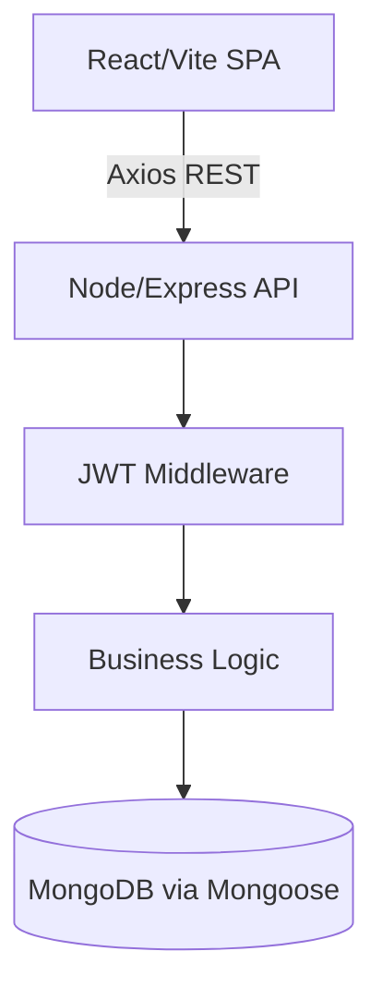
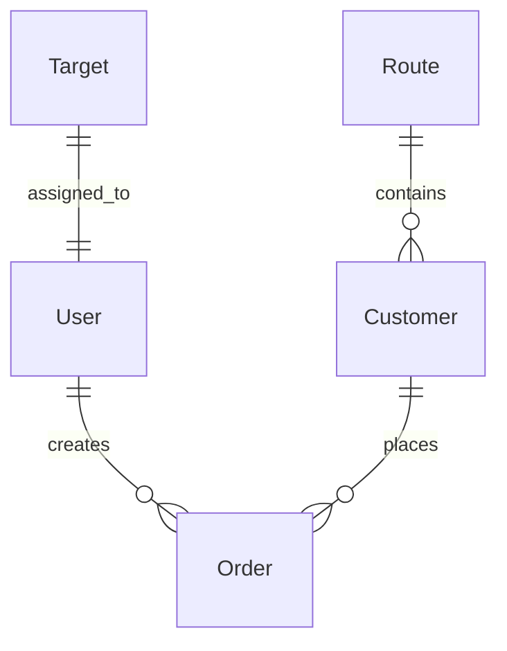

# COMPLETE SYSTEM DISCOVERY & MIGRATION READINESS AUDIT

This is the official technical documentation and architectural audit for the **Ogito Line Order Management System**. It contains a 22-part deep dive into the system's architecture, dependencies, flows, technical debt, and readiness for a dynamic product migration.

---

## PART 1 — PROJECT OVERVIEW

- **Purpose:** A daily operations, sales, and delivery management system for food production routes.
- **Business Domain:** Food manufacturing & route distribution.
- **Main Users:** Sales Executives (data entry), Drivers (delivery confirmation), Admins/CEOs (oversight, customer config, KPI tracking).
- **Architecture:** Client-Server Monolith.
- **Folder Structure:**
  - `client/`: React 18, Vite, Tailwind CSS, Shadcn UI, Context API.
  - `server/`: Node.js, Express, MongoDB/Mongoose, JWT.
- **Data Flow:** MongoDB ➔ Mongoose ➔ Express Controller ➔ REST API ➔ Axios ➔ React Context ➔ Shadcn UI Components.
- **Authentication Flow:** PIN-based login ➔ JWT stored in HTTP-Only Cookies & `localStorage` ➔ Verified via `verifyToken` middleware.

---

## PART 2 — DATABASE ANALYSIS

### 1. `User` Model
- **Fields**: `username`, `name`, `pin`, `role`, `pushSubscriptions`.
- **Hooks**: `pre('save')` hashes PIN via bcrypt.

### 2. `Customer` Model
- **Fields**: `name`, `route` (ObjectId), `salesExecutive`, `greenPrice`, `orangePrice`, `phone`.
- **Indexes**: Compound index on `salesExecutive` & `name` for fast filtering.

### 3. `Order` Model
- **Fields**: `date`, `customerId`, `salesExecutive`, `route`, `vehicle`, `standardQty`, `premiumQty`, `deliveryStatus`, `billed`, `isCancelled`.
- **Relationships**: Ref to `Customer`, `User` (createdBy), `Route`.
- **Subdocument**: `orderMessages` (Array).

### 4. `Route` Model
- **Fields**: `name`, `isActive`.

### 5. `Target` Model
- **Fields**: `username`, `month` (YYYY-MM), `target`.

### 6. `Notification` Model
- **Fields**: `recipient`, `sender`, `message`, `type`. TTL index of 30 days.

---

## PART 3 — API ANALYSIS

| Route | Method | Controller | Auth | Roles | Description |
|-------|--------|------------|------|-------|-------------|
| `/api/auth/login` | POST | `login` | None | All | Verifies username/PIN |
| `/api/orders` | GET | `getAllOrders` | JWT | All | Fetches orders. Aggregation pipelines calculate totals. |
| `/api/orders` | POST | `createOrder` | JWT | All | Duplicate checking (1 per customer per day) |
| `/api/orders/export`| GET | `exportToCSV` | JWT | All | Aggregates and returns CSV string |
| `/api/customers` | GET | `getCustomers` | JWT | Admin/CEO | List customers |
| `/api/customers/import`| POST| `importCSV` | JWT | Admin/CEO | Bulk insert |

---

## PART 4 — FRONTEND ANALYSIS

- **`App.tsx`**: Sets up React Router and `<ProtectedRoute>`.
- **`Login.tsx`**: Uses `AuthContext.login`.
- **`Orders.tsx`**: Uses `OrdersContext`. Advanced filtering. Shows `OrderTable` and `OrderFormModal`.
- **`Customers.tsx`**: Admin only. Shows customer cards (mobile) and table (desktop).
- **`Dashboard.tsx`**: Global view. Uses Recharts to show Revenue, Standard Qty, Premium Qty.

---

## PART 5 — COMPONENT ANALYSIS

- **`OrderFormModal.tsx`**: 
  - **Props**: `isOpen`, `onClose`, `editingOrder`, `onSaveSuccess`.
  - **Logic**: Debounces customer search. Calculates `Total = (StdQty * GreenPrice) + (PremQty * OrangePrice)` on the client side dynamically before submission.
- **`OrderTable.tsx`**:
  - Render logic changes strictly based on `visibleColumns`. Handles role-based action buttons.

---

## PART 6 — CONTEXT ANALYSIS

1. **`AuthContext.tsx`**:
   - **State**: `user`, `token`, `isAdmin`, `isCeo`.
   - **Flow**: Hydrates from cookies/localStorage on mount.
2. **`OrdersContext.tsx`**:
   - **State**: `orders[]`, `standardStock`, `premiumStock`.
   - **Actions**: `SET_ORDERS`, `MARK_ORDER_DELIVERED`, `CANCEL_ORDER`.
   - **Lifecycle**: Used for optimistic UI updates when delivery status changes.

---

## PART 7 — BUSINESS WORKFLOWS

**Order Creation Workflow:**
1. Sales Exec clicks "Create Order".
2. Types customer name. Modal queries API.
3. Selects customer. `Route` and `Executive` are snapshotted.
4. Enters Qty. Total is calculated locally.
5. POST `/api/orders`. API checks for duplicate orders for the same day.
6. DB Save. Push notification sent to admin.

---

## PART 8 — UI INVENTORY

- **Inputs**: Custom Shadcn `<Input>` with floating labels.
- **Tables**: Responsive tables that collapse into mobile Cards based on viewport.
- **Charts**: Recharts BarChart in Dashboard.
- **Dialogs**: Radix UI based `<Dialog>`.

---

## PART 9 — COMPLETE PRODUCT DEPENDENCY AUDIT (CRITICAL)

The system suffers from extreme technical debt regarding products. The concepts of "Standard" and "Premium" are hardcoded into the DB, API, and UI.

- **`server/src/models/Order.ts`**: `standardQty`, `premiumQty`.
- **`server/src/models/Customer.ts`**: `greenPrice`, `orangePrice`.
- **`server/src/controllers/ordersController.ts`**: (L91) `$multiply: ['$standardQty', '$customer.greenPrice']`.
- **`client/src/context/OrdersContext.tsx`**: `standardStock`, `premiumStock`.
- **`client/src/pages/Orders.tsx`**: Total loops calculating `acc.totalStandardQty`.
- **`client/src/components/orders/OrderFormModal.tsx`**: Hardcoded UI fields for Standard and Premium Qty.
- **Risk Level**: VERY HIGH. Replacing these requires a ground-up rewrite of Order and Customer interactions.

---

## PART 10 — DATABASE QUERY ANALYSIS

- **Heavy Aggregation**: `getAllOrders` in `ordersController.ts` uses `$lookup` to join `Customers` and `Routes`, then uses `$facet` to output paginated rows and global totals in a single query.
- **Performance Risk**: The `$regex` search inside the aggregation pipeline skips indexes and does collection scans if the dataset grows large.

---

## PART 11 — DASHBOARD ANALYSIS

- **Data Source**: The `summary` facet from `/api/orders`.
- **Widgets**: Total Orders, Total Revenue, Standard Qty Delivered, Premium Qty Delivered.
- **Risk**: Hardcoded metrics will break immediately if product schemas are made dynamic.

---

## PART 12 — REPORTING ANALYSIS

- **Export to CSV**: Flat file generation mapping `$standardQty` to column "Standard Qty". This is deeply coupled and will fail if products become dynamic.

---

## PART 13 — CUSTOMER ANALYSIS

- Customers are directly tied to an explicit `route` and `salesExecutive`.
- Pricing is hardcoded at the schema level (`greenPrice`, `orangePrice`).

---

## PART 14 — ORDER ANALYSIS

- Orders are unique per Customer per Date.
- Pricing is derived from the Customer schema at the time of querying (via `$lookup`), not snapshotted into the Order table. **This is a financial data risk** (if customer price changes, historical order totals change retroactively).

---

## PART 15 — SECURITY ANALYSIS

- **JWT Auth**: Secure.
- **RBAC Guards**: Secure. `isGlobalViewer` accurately restricts DB lookups for Sales Execs.

---

## PART 16 — PERFORMANCE ANALYSIS

- **N+1 Avoided**: `ordersController` aggregates beautifully.
- **Missing Snapshot**: The dynamic `$multiply` calculation per query instead of storing `totalPrice` at creation time wastes CPU cycles and damages historical integrity.

---

## PART 17 — CODE QUALITY ANALYSIS

- **Technical Debt**: Hardcoded products.
- **Duplicate Logic**: `OrderFormModal.tsx` replicates the total calculation logic found in `ordersController.ts`.

---

## PART 18 — FILE DEPENDENCY MAP

| File | Purpose | Depends On | Risk |
|---|---|---|---|
| `ordersController.ts` | Order API Logic | `Order`, `Customer`, `Route` | HIGH |
| `OrdersContext.tsx` | UI State | `api.ts` | HIGH |
| `OrderFormModal.tsx`| UI Form | `Customer API` | HIGH |

---

## PART 19 — IMPACT ANALYSIS (MIGRATION)

If `standardQty`/`premiumQty`/`greenPrice`/`orangePrice` are replaced with an `items[]` array and a dynamic `Product` collection:

- **Database Changes Required**: HIGH.
- **Aggregation Changes Required**: CRITICAL. The entire `$facet` pipeline must be rewritten with `$unwind`.
- **Frontend Changes Required**: HIGH. Modals, Tables, Context, and Dashboards must be rewritten to iterate over product arrays.
- **Backward Compatibility**: BROKEN. A one-time data migration script is mandatory.

---

## PART 20 — MIGRATION PLAN

**Phase 1: Database Foundation**
- Create `Product` model.
- Update `Customer` model to `priceOverrides: [{ product, price }]`.
- Update `Order` model to `items: [{ product, qty }]`.

**Phase 2: Backend Rewrite**
- Rewrite `getAllOrders` to `$unwind` the `items` array for calculations.
- Update `exportToCSV` to pivot array items into dynamic CSV columns.

**Phase 3: Frontend Rewrite**
- Rewrite `OrderFormModal` to fetch `/api/products` and map inputs.
- Rewrite `OrderTable` to dynamically generate columns based on active products.
- Rewrite `Dashboard` KPI metrics.

**Phase 4: Data Migration & Testing**
- Run `migrateProducts.ts` to convert legacy qty fields into the `items` array.
- Verify historical totals match.

**Phase 5: Cleanup**
- Delete legacy fields from Mongoose schemas.

---

## PART 21 — TESTING PLAN

- **Regression**: Test Order duplicate blocking.
- **Database**: Ensure MongoDB `$facet` aggregations perform correctly with `$unwind`.
- **UI**: Ensure dynamic columns do not break mobile responsiveness.

---

## PART 22 — FINAL DOCUMENTATION SUMMARY

The system is stable and secure but suffers from severe architectural rigidity regarding "Products". The migration to a dynamic product system touches every layer of the MERN stack—from MongoDB aggregations to React Contexts. 

By executing the 5-Phase Migration Plan outlined above, the technical debt will be eliminated, enabling infinite product scalability.
