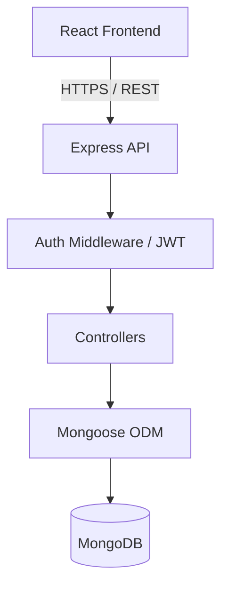
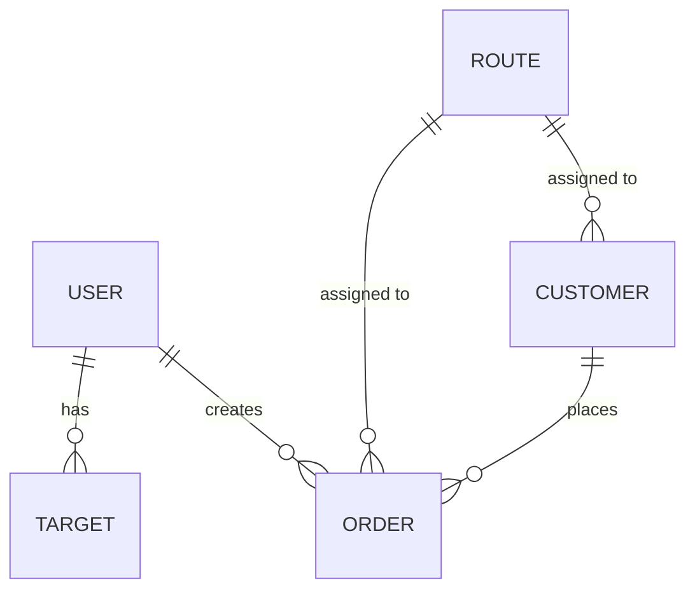

# Complete System Audit – Ogito Line Order Management System

This document provides a comprehensive, deep-dive architectural audit of the entire Ogito Line Order Management System. It serves as the definitive reference before undertaking the dynamic product system migration. 

---

## 1. High-Level Architecture

The system follows a standard MERN-stack architecture (MongoDB, Express, React, Node.js) with TypeScript used across both environments.

**Overall Architecture:**
- **Frontend (Client):** Single Page Application built with React (Vite), styled with Tailwind CSS and Shadcn UI. State is managed via React Context.
- **Backend (Server):** REST API built with Express.js and Node.js.
- **Database:** MongoDB queried via Mongoose.
- **Authentication:** JWT-based stateless authentication using HTTP-only cookies/Authorization headers. PIN-based login instead of passwords.

**Folder Structure:**
```
ogito-line-order/
├── client/
│   ├── src/
│   │   ├── components/  # Reusable UI (Shadcn, modals, tables)
│   │   ├── context/     # AuthContext, OrdersContext
│   │   ├── lib/         # Axios instance (api.ts), utilities
│   │   ├── pages/       # Route pages (Login, Orders, Dashboard, etc.)
│   │   └── types/       # TypeScript interfaces
├── server/
│   ├── src/
│   │   ├── controllers/ # Business logic
│   │   ├── middleware/  # Auth & Role guards
│   │   ├── models/      # Mongoose schemas
│   │   ├── routes/      # API endpoints
│   │   └── scripts/     # Seeding & Migration utilities
```

**Architecture Diagram:**



---

## 2. Database Audit



### Models:
1. **User (`User.ts`)**: 
   - **Fields**: `username`, `name`, `pin` (bcrypt hashed), `role` (`admin`, `user`, `driver`, `ceo`), `pushSubscriptions`.
   - **Indexes**: Unique on `username`.
2. **Customer (`Customer.ts`)**: 
   - **Fields**: `name`, `route` (Ref Route), `salesExecutive`, `greenPrice`, `orangePrice`, `phone`.
   - **Indexes**: Unique on `name`, compound on `salesExecutive` & `name`.
3. **Order (`Order.ts`)**:
   - **Fields**: `date`, `customerId`, `salesExecutive`, `route`, `vehicle`, `standardQty`, `premiumQty`, `createdBy`, `deliveryStatus`, `isCancelled`, `billed`, `orderMessages`.
   - **Indexes**: heavily indexed on `date`, `salesExecutive`, `route`, `vehicle`, `customerId`.
4. **Route (`Route.ts`)**: 
   - **Fields**: `name`, `isActive`.
   - **Indexes**: Unique on `name`.
5. **Target (`Target.ts`)**: 
   - **Fields**: `username`, `month` (YYYY-MM), `target`.
   - **Indexes**: Compound unique on `username` + `month`.
6. **Notification (`Notification.ts`)**: 
   - **Fields**: `recipient`, `sender`, `title`, `message`, `type`, `isRead`.
   - **Indexes**: TTL index for auto-deletion after 30 days.

---

## 3. API Audit

| Route | Method | Controller Action | Roles Allowed | Purpose |
|-------|--------|-------------------|---------------|---------|
| `/api/auth/login` | POST | `login` | All | Authenticates user, returns JWT |
| `/api/orders` | GET | `getAllOrders` | All | Fetches orders (User sees own; Admin/Driver sees all) |
| `/api/orders` | POST | `createOrder` | All | Creates new order |
| `/api/orders/:id` | PUT/DEL | `updateOrder` / `deleteOrder` | All* / Admin | Modifies or deletes order |
| `/api/orders/export` | GET | `exportToCSV` | All | Exports filtered orders to CSV |
| `/api/customers` | GET/POST | `getCustomers` / `createCustomer`| Admin/CEO/Driver | Manages clients |
| `/api/customers/import`| POST | `importCSV` | Admin/CEO | Bulk creates customers |
| `/api/routes` | GET/POST | `getRoutes` / `createRoute` | Admin/CEO | Manages geographical routes |
| `/api/users` | GET/POST | `getUsers` / `createUser` | Admin/CEO | Manages employees |
| `/api/targets`| GET/POST | `getTargets` / `createTarget` | Admin/CEO | Manages monthly KPIs |

---

## 4. Frontend Page Audit

**Navigation Map:**
`Login` ➔ `Dashboard` (Admin/CEO) ➔ `Orders` ➔ `Customers` ➔ `Users` ➔ `Routes` ➔ `Targets`.

1. **`Orders.tsx`**: The core operational page. Uses `OrdersContext`. Features advanced filtering (Date, Route, Vehicle, Exec), a large data table, and triggers the `OrderFormModal`.
2. **`Customers.tsx`**: (Admin only). Manages the customer database. Features Add/Edit forms, CSV Import/Export, and pricing configurations (`greenPrice`, `orangePrice`).
3. **`Dashboard.tsx`**: (Global Viewers). Aggregates data from `/api/orders`. Displays KPI cards (Revenue, Standard Qty, Premium Qty) using `recharts`.
4. **`Login.tsx`**: Simple PIN-based authentication form. Updates `AuthContext`.
5. **`Routes.tsx`, `Targets.tsx`, `Users.tsx`**: Administrative CRUD pages.

---

## 5. Component Audit

- **`OrderFormModal.tsx`**: Highly complex modal. Takes `editingOrder` as a prop. Handles customer searching (debounce logic), calculates dynamic totals (`standardQty * greenPrice`), and submits to API.
- **`ProtectedRoute.tsx`**: Wraps routes in `App.tsx`. Checks `AuthContext.isAuthenticated` and `role`.
- **`ui/` (Shadcn components)**: Dumb components (Button, Input, Dialog, Select). Highly reusable, purely presentational.

---

## 6. Order Flow

1. **Login**: Sales Exec logs in.
2. **Order Creation**: Clicks "New Order" on `Orders.tsx`.
3. **Customer Selection**: Types in search box; fetches `/api/customers?search=...`.
4. **Data Entry**: Enters `standardQty` and `premiumQty`. Modal calculates `Total = (StdQty * GreenPrice) + (PremQty * OrangePrice)`.
5. **Database**: POST `/api/orders`. `ordersController` verifies no duplicate exists for that day, saves to MongoDB.
6. **Dashboard**: Admin sees real-time update in KPIs.
7. **Delivery**: Driver logs in, clicks "Mark Delivered". API updates `deliveryStatus`.

---

## 7. Customer Flow

1. **Creation**: Admin opens `Customers.tsx`, creates a user. Assigns a `Route`, `Sales Executive`, `Green Price` (Std), and `Orange Price` (Prem).
2. **Usage**: When a Sales Exec searches for a customer, the customer's route and pricing are snapshotted onto the Order. 

---

## 8. Product Dependency Audit

**WARNING: Hardcoded Product Debt.**
The fields `standardQty`, `premiumQty`, `greenPrice`, and `orangePrice` are deeply embedded.

- **Models**: `server/src/models/Order.ts` (L19, L20), `server/src/models/Customer.ts` (L7, L8).
- **Controllers**: `server/src/controllers/ordersController.ts` calculates totals via MongoDB Aggregation (`$multiply: ['$standardQty', '$customer.greenPrice']`).
- **CSV Export**: `ordersController.ts` (L546) maps 'Standard Qty' and 'Premium Qty'.
- **Frontend Modals**: `OrderFormModal.tsx` contains specific UI blocks for "Standard Qty" and "Premium Qty".
- **Frontend Tables**: `Orders.tsx` and `OrderTable.tsx` have dedicated columns for these fields.
- **Dashboard**: `Dashboard.tsx` calculates separate KPI cards for Std Qty and Prem Qty.

---

## 9. Dashboard Audit

The Dashboard relies on the `summary` object returned by `GET /api/orders`.
- **Data Source**: Aggregation pipeline in `ordersController.ts` using `$facet`.
- **Calculations**: `$sum: '$standardQty'`, `$sum: '$totalRevenue'`.
- **Role Restrictions**: Only `admin` and `ceo` roles have access to this page.

---

## 10. CSV Import/Export Audit

- **Customer Import**: (`customersController.ts`) Uses `csv-parse`. Expects exact headers: `Name`, `Route`, `SalesExecutive`, `GreenPrice`, `OrangePrice`, `Phone`. Maps them to the Customer model.
- **Order Export**: (`ordersController.ts`) Uses `csv-stringify`. Generates a flat file with hardcoded headers: `Standard Qty`, `Premium Qty`, `Total`.

---

## 11. Role Permission Audit

| Feature | User (Sales) | Driver | Admin | CEO |
|---------|-------------|--------|-------|-----|
| View Orders | Self only | All | All | All |
| Create Order | Yes | Yes | Yes | Yes |
| Delete Order | No | No | Yes | Yes |
| Edit Billed/Cancel | No | Yes(Cancel) | Yes | Yes |
| Customers Page | No | No | Yes | Yes |
| Dashboard | No | No | Yes | Yes |
| Users/Targets/Routes| No | No | Yes | Yes |

---

## 12. Data Flow Audit (Orders)

1. **MongoDB**: Order document is updated.
2. **Mongoose**: Returns updated document.
3. **Controller**: `ordersController.getAllOrders` uses Aggregation Pipeline to attach Customer data and calculate totals.
4. **API Route**: Sends JSON back.
5. **Axios**: `api.get('/orders')` receives data.
6. **Context/Component**: `Orders.tsx` sets state `orders`.
7. **UI**: Re-renders `<OrderTable />`.

---

## 13. Technical Debt Audit

1. **Hardcoded Products**: The biggest vulnerability. The system assumes exactly two products (Standard/Premium). Adding a third product currently requires altering the DB schema, the API aggregations, the UI, and the CSV logic.
2. **Denormalization Risks**: The `ordersController.ts` calculates `total` on the fly via MongoDB aggregation, but `OrderFormModal.tsx` also calculates it on the client. 
3. **Missing Validation**: Prices are strictly bound to customers, not to a master "Product" table. If a global price changes, every customer must be updated.

---

## 14. Product Migration Impact Analysis

**Replacing standard/premium fields with a dynamic `products` and `Order.items[]` array.**

- **Critical Impact**:
  - `Order.ts` schema: Replace qty fields with `items: [{ productId, quantity, priceAtTime }]`.
  - `Customer.ts` schema: Replace hardcoded prices with `priceOverrides: [{ productId, customPrice }]`.
  - `ordersController.ts`: Entire Aggregation Pipeline must be rewritten to `$unwind` items array to calculate totals.
  - `OrderFormModal.tsx`: The UI must change from two static inputs to a dynamic mapping of available products.
- **Medium Impact**:
  - `Dashboard.tsx`: KPI cards must become dynamic based on active products.
  - `Orders.tsx`: Table columns must expand dynamically based on items.
- **Estimated Scope**: 15+ files, DB Migration script required. Backward compatibility is broken unless mapped.

---

## 15. Migration Plan

*Do not write code for this yet. This is the roadmap.*

**Phase 1: Foundation (Master Products)**
- **Objective:** Create a `Product` model to define global products (e.g., Standard, Premium).
- **Files:** `models/Product.ts`, `controllers/productsController.ts`, `routes/products.ts`.
- **Risk:** Low (Non-destructive).

**Phase 2: Customer Schema Update**
- **Objective:** Support dynamic pricing overrides.
- **Files:** `Customer.ts`, `customersController.ts`, `Customers.tsx`.
- **Action:** Add `customPrices` array. Keep `greenPrice`/`orangePrice` temporarily for dual-write compatibility.

**Phase 3: Order Schema & Controller Rewrite**
- **Objective:** Support `items` array.
- **Files:** `Order.ts`, `ordersController.ts`.
- **Action:** Update the MongoDB aggregation pipeline to calculate totals based on the `items` array.

**Phase 4: Frontend Overhaul**
- **Objective:** Make UI dynamic.
- **Files:** `OrderFormModal.tsx`, `OrderTable.tsx`, `Dashboard.tsx`, CSV logic.
- **Action:** Render inputs based on fetched `Products` list.

**Phase 5: Data Migration & Cleanup**
- **Objective:** Convert old order data to the new schema.
- **Action:** Write a Node script (`scripts/migrateProducts.ts`) that maps `standardQty` -> `items: [{ product: 'Standard', qty... }]`. Once verified, delete old fields.
