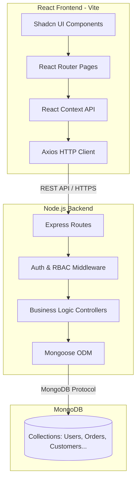

# 2. ARCHITECTURE SPECIFICATION

## 2.1 Overview
The application follows a monolithic client-server architecture using the MERN stack (MongoDB, Express, React, Node.js). 



## 2.2 Folder Hierarchy

```text
ogito-line-order/
├── client/                      # React Frontend Application
│   ├── public/                  # Static assets
│   ├── src/
│   │   ├── components/          # Reusable UI components
│   │   │   ├── orders/          # Order-specific components (e.g., OrderFormModal)
│   │   │   ├── theme/           # Theme provider
│   │   │   └── ui/              # Shadcn UI primitives (Button, Input, Dialog)
│   │   ├── context/             # React Contexts (AuthContext, OrdersContext)
│   │   ├── hooks/               # Custom React hooks (e.g., use-toast)
│   │   ├── lib/                 # Utilities and Axios instance (api.ts)
│   │   ├── pages/               # Route-level page components
│   │   └── types/               # TypeScript interfaces
│   ├── index.html
│   ├── package.json
│   ├── tailwind.config.js       # Tailwind CSS configuration
│   └── vite.config.ts           # Vite bundler configuration
│
├── server/                      # Node.js Backend Application
│   ├── src/
│   │   ├── config/              # Constants (e.g., ROLES)
│   │   ├── controllers/         # Core business logic for API endpoints
│   │   ├── middleware/          # JWT verification and Role guards
│   │   ├── models/              # Mongoose schemas
│   │   ├── routes/              # Express route definitions
│   │   ├── scripts/             # DB seeding and migration utilities
│   │   ├── services/            # External services (e.g., Web Push)
│   │   └── index.ts             # Express server entry point
│   ├── .env.example
│   ├── package.json
│   └── tsconfig.json
│
└── README.md
```

## 2.3 Client Architecture
- **Framework**: React 18 built with Vite for HMR and optimized production builds.
- **State Management**: Local component state (useState, useReducer) for UI logic, and React Context (`AuthContext`, `OrdersContext`) for global state.
- **Styling**: Tailwind CSS combined with `shadcn/ui` for accessible, unstyled components.
- **Routing**: `react-router-dom` using `<BrowserRouter>`. Protected routes are wrapped in a `<ProtectedRoute>` component that checks the AuthContext.

## 2.4 Server Architecture
- **Framework**: Express.js with Node.js.
- **Language**: TypeScript (`ts-node` for dev, `tsc` for build).
- **Data Access**: Mongoose ODM. Complex queries (like Dashboard KPIs) are handled via MongoDB Aggregation Pipelines (`$facet`, `$lookup`, `$group`).

## 2.5 Authentication & Authorization Architecture
- **Authentication**: Stateless. Users log in with a `username` and a hashed `pin`. The server issues a JWT.
- **Storage**: The JWT is stored in an HTTP-Only cookie (`Cookies.set`) and the user object in `localStorage`.
- **Authorization**: Express middleware (`verifyToken`, `isAdmin`, `isDriverOrAdmin`) intercepts routes. The `AuthRequest` interface extends the Express Request to include the decoded JWT payload.

## 2.6 Build & Deployment Process
- **Client**: `npm run build` executes `tsc -b && vite build`.
- **Server**: `npm run build` executes `tsc`. The server serves the API on port 5000 (default).
- **Environment Variables**:
  - Server: `MONGODB_URI`, `JWT_SECRET`, `PORT`, VAPID keys for push notifications.
  - Client: `VITE_API_URL`, VAPID public key.

## 2.7 Third-Party Libraries
- **Frontend**: `axios` (HTTP), `lucide-react` (Icons), `recharts` (Charts), `react-router-dom` (Routing), `clsx` & `tailwind-merge` (Styling utilities), `canvas-confetti` (Visuals - currently removed/disabled), `emoji-picker-react`.
- **Backend**: `bcryptjs` (Hashing), `jsonwebtoken` (Auth), `mongoose` (DB), `csv-parse` & `csv-stringify` (CSV Operations), `web-push` (Notifications), `cors`.
