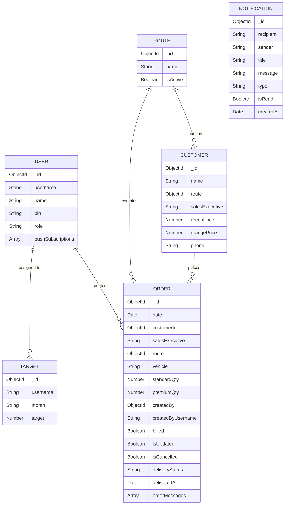

# 3. DATABASE SPECIFICATION

## 3.1 Overview
The system uses MongoDB with Mongoose ODM. It consists of 6 core collections.

## 3.2 Collection Analysis

### 1. `User` Model (`server/src/models/User.ts`)
- **Purpose**: Manages authentication and RBAC.
- **Fields**:
  - `username` (String, Required, Unique, Trimmed)
  - `name` (String, Required)
  - `pin` (String, Required, stored as bcrypt hash)
  - `role` (Enum: `admin`, `user`, `driver`, `ceo`, Default: `user`)
  - `pushSubscriptions` (Array of Web Push keys)
- **Middleware**: `pre('save')` hook generates salt and hashes `pin`.
- **Methods**: `comparePin(candidatePin: string)` -> Promise<boolean>.

### 2. `Customer` Model (`server/src/models/Customer.ts`)
- **Purpose**: Stores client profiles and their pricing tiers.
- **Fields**:
  - `name` (String, Required, Trimmed)
  - `route` (ObjectId, ref: 'Route')
  - `salesExecutive` (String, Required)
  - `greenPrice` (Number, Required, min: 0) *(Technical Debt)*
  - `orangePrice` (Number, Required, min: 0) *(Technical Debt)*
  - `phone` (String, Default: '')
- **Indexes**: 
  - Unique on `{ name: 1 }` (collation: locale 'en', strength 2).
  - Compound on `{ salesExecutive: 1, name: 1 }`.
  - `{ salesExecutive: 1 }`.

### 3. `Order` Model (`server/src/models/Order.ts`)
- **Purpose**: Records daily transaction data.
- **Fields**:
  - `date` (Date, Required)
  - `customerId` (ObjectId, ref: 'Customer')
  - `salesExecutive` (String, Indexed)
  - `route` (ObjectId, ref: 'Route')
  - `vehicle` (String)
  - `standardQty` (Number, Default: 0) *(Technical Debt)*
  - `premiumQty` (Number, Default: 0) *(Technical Debt)*
  - `deliveryStatus` (Enum: ['Pending', 'Delivered'], Default: 'Pending')
  - `orderMessages` (Array of IOrderMessage subdocuments containing text, role, status, etc.)
- **Indexes**: 
  - `{ date: -1 }`
  - Compound on `{ salesExecutive: 1, date: -1 }`
  - Compound on `{ route: 1, date: -1 }`
  - Compound on `{ vehicle: 1, date: -1 }`
  - Compound on `{ customerId: 1, date: -1 }`

### 4. `Route` Model (`server/src/models/Route.ts`)
- **Purpose**: Represents geographical delivery zones.
- **Fields**:
  - `name` (String, Required, Unique, Uppercase)
  - `isActive` (Boolean, Default: true)

### 5. `Target` Model (`server/src/models/Target.ts`)
- **Purpose**: Monthly KPI goals for sales executives.
- **Fields**:
  - `username` (String, Required, Indexed)
  - `month` (String, Format: YYYY-MM)
  - `target` (Number, min: 0)
- **Indexes**: Compound Unique on `{ username: 1, month: 1 }`.

### 6. `Notification` Model (`server/src/models/Notification.ts`)
- **Purpose**: System and order change request notifications.
- **Fields**:
  - `recipient`, `sender`, `title`, `message`, `type`, `isRead`.
- **Indexes**: TTL index on `createdAt` (`expireAfterSeconds: 30 * 24 * 60 * 60`) for auto-deletion after 30 days.
